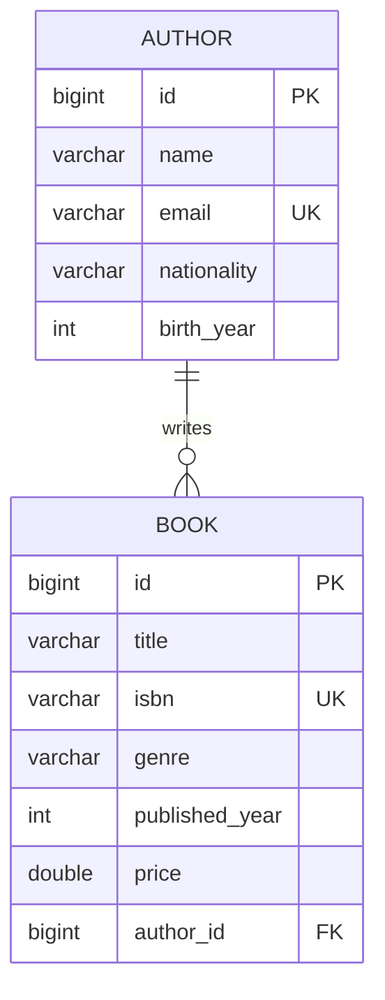

# Entity Relationship Diagram

## ER Diagram

```
┌─────────────────────────────┐          ┌─────────────────────────────────┐
│           AUTHOR             │          │              BOOK                │
├─────────────────────────────┤          ├─────────────────────────────────┤
│ PK  id          BIGINT       │          │ PK  id           BIGINT          │
│     name        VARCHAR      │          │     title        VARCHAR         │
│     email       VARCHAR (UQ) │          │     isbn         VARCHAR (UQ)    │
│     nationality VARCHAR      │          │     genre        VARCHAR         │
│     birth_year  INTEGER      │          │     published_year INTEGER       │
│                              │          │     price        DOUBLE          │
│                              │          │ FK  author_id    BIGINT          │
└─────────────────────────────┘          └─────────────────────────────────┘
             │                                            │
             │         One Author → Many Books            │
             │                                            │
            (1) ──────────────────────────────────────► (∞)
```

## Relationship

| | |
|---|---|
| **Type** | One-to-Many |
| **Parent** | Author |
| **Child** | Book |
| **Foreign Key** | `book.author_id` → `author.id` |

One **Author** can write many **Books**, but each **Book** belongs to exactly one **Author**.

## Attributes

### Author
| Column | Type | Constraint |
|--------|------|------------|
| id | BIGINT | PRIMARY KEY, AUTO INCREMENT |
| name | VARCHAR | NOT NULL |
| email | VARCHAR | NOT NULL, UNIQUE |
| nationality | VARCHAR | - |
| birth_year | INTEGER | - |

### Book
| Column | Type | Constraint |
|--------|------|------------|
| id | BIGINT | PRIMARY KEY, AUTO INCREMENT |
| title | VARCHAR | NOT NULL |
| isbn | VARCHAR | NOT NULL, UNIQUE |
| genre | VARCHAR | - |
| published_year | INTEGER | - |
| price | DOUBLE | - |
| author_id | BIGINT | FOREIGN KEY → author(id), NOT NULL |

## JPA Annotations

```java
// Author.java
@OneToMany(mappedBy = "author", fetch = FetchType.LAZY)
private List<Book> books;

// Book.java
@ManyToOne(fetch = FetchType.EAGER)
@JoinColumn(name = "author_id", nullable = false)
private Author author;
```

## Mermaid Diagram


